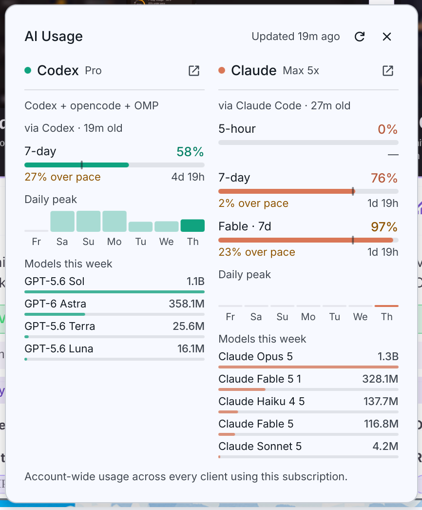

# Subscription Usage Meter

Account-wide Codex and Claude subscription usage in one native, theme-aware DankBar
widget for [Dank Material Shell](https://danklinux.com).



The bar carries one small vertical meter per subscription. Click it for a popout that
puts both providers side by side with the quota windows each one actually reports,
their reset times, optional pacing, a seven-day peak strip, and the models that ran
this week.

## Requirements

| | |
| --- | --- |
| Dank Material Shell | 1.6 or newer |
| Python | 3.10 or newer, standard library only |
| Codex usage | an existing Codex, pi, OMP, or opencode login |
| Claude usage | a recent `claude` executable on `PATH` (verified with Claude Code 2.1.263) |

Nothing is installed beyond the plugin itself. The collector reads the logins your
clients already wrote and never asks you to paste a token.

## Install

### From the plugin registry

In DMS: **Settings → Plugins**, find **Subscription Usage Meter** in the registry,
install it, then add the widget under **Settings → DankBar → Widgets**.

### From git

```sh
mkdir -p ~/.config/DankMaterialShell/plugins
git clone https://github.com/ilajosmanov/dms-ai-usage-tracker \
  ~/.config/DankMaterialShell/plugins/aiUsage
dms restart
```

Then enable it under **Settings → Plugins** and add the widget to a bar.

### From a checkout, for development

```sh
python3 scripts/install.py
```

Links this checkout into `~/.config/DankMaterialShell/plugins/aiUsage`, enables it,
and adds it to the first enabled bar. Existing settings are preserved and backed
up before modification. Keep this checkout in place. Use `--no-bar` to place the
widget yourself under DMS Settings → DankBar → Widgets.

## Uninstall

Remove the widget from the bar, disable the plugin under Settings → Plugins, and
delete `~/.config/DankMaterialShell/plugins/aiUsage`. Cached usage lives in
`~/.cache/dms-ai-usage/` and can be deleted with it.

## Usage

The bar shows one small vertical bar per consuming subscription, followed by
color-matched percentages, without a text title. Each bar is its own quota: it fills
from the bottom in proportion to that provider's displayed primary window, so 38% Codex
and 56% Claude are two independently filled columns, never a shared total. Provider
color is the one thing here that does not follow your Material You palette, and the
fills are the exact brand hex in light and dark themes, so a meter always reads as its
own subscription. Brand-colored *text* darkens on a light surface, because the brand
hex itself falls under the 4.5:1 contrast floor there. Idle providers keep their empty
bar and 0% label, even when the other provider is active; unknown
usage shows a dash, and a provider with no usable window drops out of the bar entirely.

Each active provider gets its own upward arrow when at least two percentage points
over its linear pace, matching the column's pacing label and provider color.
Both can show arrows at once. Unknown reset times and stale data do not produce
pace warnings. The **Show pacing** setting controls these arrows too. Vertical bars
stack the percentages under the same twin columns, with the arrow trailing the number
so both providers' digits align.

Click to open the popout. Right-click, or use its refresh button, to check usage now.

The popout shows **both providers side by side**, one column each, so comparing them
costs no clicks and the two subscriptions can never read as one pool. Codex is on the
left by default; the **Primary provider** setting swaps the columns. Each column carries
its own plan, clients, limits, week, models, and `open_in_new` dashboard link, and its
own status: Codex can be disconnected while Claude is fully readable beside it. A filled
surface appears only for a provider that needs attention, so a fill means a problem
rather than a section. Multiple accounts for one provider get a native DMS selector in
that provider's column, opening on its highest-utilization account; manual selections
persist through refreshes and do not disturb the other column.

Every limit is one row: window, percentage, a track whose fill is the brand color, and a
notch marking where even consumption would have put you. Under it sit the pace verdict
and the bare countdown. The percentage is brand-tinted until the window is at least 90%
consumed, when it turns to the theme's caution color — over pace and nearly out are
separate signals, and both can be true. Row labels drop their "window" suffix to fit the
column; the unshortened label and the spelled-out reset time are in the row's tooltip,
which opens at the cursor rather than at the middle of the row and flips to the other
side when the popout edge is close. The accessible name carries all of it. The header keeps the update time, refresh, and close visible
while scrolling, and reports the newest column that is actually live; a column
serving saved usage dates itself instead, so one backed-off provider cannot make a
refresh that did work read as one that did nothing.
Overflow uses the native DMS auto-hiding scrollbar.

The dashboard displays actual quota windows returned by each provider, reset times,
and optional pacing against the elapsed portion of a known fixed-length window.
Weekly-only Codex accounts are correctly labeled weekly. Claude may return usage
without a reset time; the widget does not invent one. Codex Spark quota buckets and
Anthropic's undocumented Nimbus Quill placeholder are intentionally hidden; real
model-scoped Claude limits such as Fable remain visible.

Each column's seven-day strip records daily peak primary-window utilization observed by
this widget, today's bar at full brand strength. Unsampled days are missing, not zero.
It is a quota chart, not a spend chart, and each day's date and peak are in its tooltip.

**Models this week** closes each column with every model that ran, busiest first, one bar
per model, scaled against that provider's busiest. Release-date suffixes are trimmed from
model ids to fit; the tooltip carries the full name. It totals
the tokens each model processed in local sessions over the last seven days — input, output,
and cache reads — and scales every bar against the busiest model. This is the one part of
the widget that is *not* account-wide: it counts what ran in session logs on this machine,
so another device's work is not included, and it is neither billing nor quota. Codex,
pi, OMP, opencode, and Claude Code sessions all count toward it.

## Connections

Account usage is shared across clients. The collector deduplicates matching Codex
account identities and tries the freshest available login. It reads, without modifying:

- `$CODEX_HOME/auth.json` (default `~/.codex/auth.json`)
- `$CLAUDE_CONFIG_DIR/.credentials.json` (default `~/.claude/.credentials.json`)
- `$PI_CODING_AGENT_DIR/auth.json` (default `~/.pi/agent/auth.json`)
- `~/.omp/agent/auth.json` and the current OMP SQLite `~/.omp/agent/agent.db`
- `$XDG_DATA_HOME/opencode/auth.json` (default `~/.local/share/opencode/auth.json`), for Codex OAuth only

Nonstandard Codex/Claude credential paths and the OMP database can be selected in
plugin settings. For Claude, select the native profile's `.credentials.json`; its
`.claude.json` must be in the same profile directory when using a custom location.
The default profile uses `~/.claude/.credentials.json` and `~/.claude.json`.
`CLAUDE_CONFIG_DIR` is honored. Arbitrarily renamed credential files cannot be used
by the native Claude command. Codex keyring-only storage is not read. API keys are
not treated as subscription tokens.

## Where the numbers come from

Codex uses account-wide provider usage, reusing newer `rate_limits` snapshots from
its local session logs between API checks.

Claude uses **Claude Code's native `get_usage` control request**. A short background
process starts in a temporary working directory, initializes the JSON protocol,
requests subscription usage, and exits. It sends no model prompt. Claude handles
its own authentication, including renewal of an expired login, so you do not need
to keep an interactive Claude window open. The plugin does not implement or consume
Claude's refresh-token exchange itself.

The subprocess runs in safe mode with tools and MCP disabled, session persistence
disabled, and telemetry, error reporting, and automatic updates disabled. It skips the usage behavior scan,
limits captured output to 4 MB, and stops the process group after completion or a
25-second deadline. One collector lock prevents overlapping checks across bars.

The native response may contain cached fallback data after a failed provider check.
The widget therefore verifies it against `cachedUsageUtilization` in Claude's config,
including its account UUID, capture timestamp, and normalized quota windows. A cached
response is never dated as a new check. Fresh account-bound local readings avoid
starting a process at all. Claude account/organization identity controls cache and
history ownership; switching accounts does not reuse the previous account's quota.
Older captures without account identity cannot be verified by this path.

The native control interface is experimental. An unsupported CLI version, missing
executable, failed renewal, timeout, or unverified reading produces an actionable
message and retains the last verified reading when available. Update Claude Code
if it cannot answer the structured usage request. The comparison and local proof
are recorded in [the research notes](docs/claude-usage-research.md).

## Refresh and privacy

Local credentials and usage are checked every thirty seconds. Normal collection
follows the configured 2–30 minute interval for Codex and **5–30 minutes for Claude**.
Claude's minimum matches the cadence at which it persists its usage cache. Fresh
local data can update either column between collection attempts. The cache is
rewritten only when something changed.

Manual refresh bypasses the normal interval with a five-second cooldown. A click
during collection is held until the current process finishes. Provider retry waits
are retained and cannot be shortened by manual refresh. Direct HTTP responses honor
numeric or HTTP-date `Retry-After` values, including waits longer than an hour.
Claude's control response does not expose every upstream error or retry header;
when fresh data cannot be verified, retry after at least five minutes or the selected
interval, whichever is longer. This is reported as an unverified refresh, without
claiming the failure was necessarily HTTP 429.

Failures retain saved usage for at most 24 hours, with its original capture time,
stale warning, and dimmed fills. Older data is hidden. Missing readings never appear
as zero usage. A newer verified client capture can still update the column while a
retry wait is active; reading a file does not clear that wait.

The plugin reads client credentials and config. The native Claude subprocess may
renew credentials and update its own config/cache as part of collection. The plugin
never copies Claude refresh tokens to a separate credential store. Account IDs are
hashed for widget/cache identity. Credentials and raw subprocess diagnostics are
never published to QML.

Session logs are read incrementally. A file already scanned is re-read only from the byte
where the previous scan stopped, and Codex, which reports a running session total, is read
from its head and tail alone; a first scan of a long history is spread over the next few
polls rather than blocking one. The scan reads token counts and model ids. It never reads
message content, and its bookkeeping stays in
`$XDG_CACHE_HOME/dms-ai-usage/activity.json` (mode 0600).

Only usage metadata, model names with their local token totals, opaque identity hashes,
and a keyed credential fingerprint are cached in `$XDG_CACHE_HOME/dms-ai-usage/usage.json`
(default `~/.cache/dms-ai-usage/usage.json`, mode 0600, in a 0700 directory).
The fingerprint exists solely to notice that you signed in again; it is an HMAC under a
random per-install key in `fingerprint.key`, so the cache holds nothing a reader could
check a guessed token against. Refresh bookkeeping stays in that file and is never
published to the widget.

Raw credentials, email addresses, account IDs, prompts, and messages are not cached
or returned to QML. Credentials travel in HTTPS headers, not process arguments, and a
token or account id that could not be sent verbatim in a header is discarded rather
than sent. Provider-supplied text renders as plain text, never as markup.
The collector sends no telemetry or model requests. Its direct HTTP transport
rejects redirects and contacts `chatgpt.com/backend-api/wham/usage` for Codex.
Claude Code performs its own authentication and usage traffic; the plugin disables
telemetry, error reporting, and automatic updates for these background checks.
It does not enable Claude's broad essential-traffic restriction, which also blocks
the usage endpoint and causes Claude to return saved data.

## Development

```sh
python3 get-ai-usage                  # sanitized live account data
python3 get-ai-usage --force          # check now, respecting rate limits
python3 get-ai-usage --offline        # no network requests
python3 get-ai-usage --demo           # sample data; no credential reads
python3 -m unittest discover -s tests -v
node --test tests/test_usage.cjs       # presentation logic; Node needed for tests only
python3 scripts/preview.py            # render fourteen native QML states offscreen
```

Optional `--config /path/to/settings.json` accepts plugin settings, for example
`{"refreshInterval": 5}`. Otherwise settings come from DMS's
`plugin_settings.json` under `aiUsage`. The interval bounds API polling only; a client
that is running keeps the columns current between those checks at no cost, so a longer
interval is usually the better setting.

`scripts/preview.py` renders fourteen QML states offscreen against installed DMS
components: both columns side by side, per-column dashboard links, per-provider
account selection and refresh, one provider missing while the other is healthy, stale
usage, a clamped narrow layout, light theme, horizontal/vertical pill bars,
zero-usage bars, reset transitions, and two independent pace arrows. Each
dashboard state is grabbed at its own natural height, so the screenshots also measure
the panel. Tooltip size and placement are asserted from a stubbed pointer instead:
a popup renders in the window overlay, which no screenshot of the panel can reach. It runs entirely on `--demo` data in an
isolated config, and its output under `screenshots/` is an untracked test artifact.
Set `DMS_QML_ROOT` if DMS is installed somewhere other than `/usr/share/quickshell/dms`.

DMS can cache child QML components during plugin reloads. Restart DMS after updating
the plugin if old controls remain visible.

## Reporting a problem

Open an issue at
[ilajosmanov/dms-ai-usage-tracker/issues](https://github.com/ilajosmanov/dms-ai-usage-tracker/issues).
Include your DMS version (`dms version`), your Python version, and the output of
`python3 get-ai-usage` from the plugin directory. That output is sanitized: it carries
usage numbers and model names, never credentials, email addresses, or account ids.

For a widget that will not appear, check **Settings → Plugins** first, then restart
DMS — child QML components can survive a plugin reload.

## License

MIT. Inspired by [titeya/dms-claudecode](https://github.com/titeya/dms-claudecode);
attribution to Nicolas Bellamy's reference design is retained in LICENSE.
